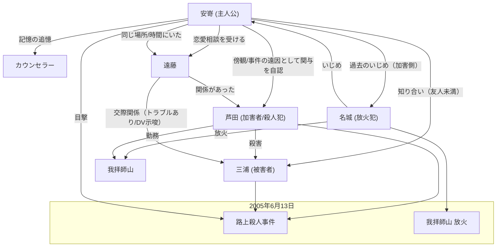

# 登場人物相関図

---

## 登場人物の詳細

| 氏名/名称 | 2005年時の年齢 (2026年時) | ジェンダー | 役割/立場 | 詳細・推測される背景 |
|-----------|---------------------------|------------|-----------|----------------------|
| 安嵜 (やすざき) | 29歳 (50歳) | he/him | 主人公 | 2005年6月13日の香川県善通寺で起きた暴動事件の傍観者。事件の記憶を封じ込めていたが、21年後にカウンセリングに通い、記憶を辿っている。事件の犯人グループに関係する遠藤と関わったことが、事件の遠因となったのではないかと苦しんでいる。名城をいじめていたグループの一員。 |
| カウンセラー | - (45歳) | They/Them | 安嵜の担当カウンセラー | 安嵜の話を聞き、彼の記憶に関わる人物や事件をある程度把握している。安嵜が記憶に向き合えるよう、優しく導く役割。 |
| 芦田 (あしだ) | 30歳 | he/him | 殺人事件の犯人 | 三浦を殺害した人物（シナリオ内では「芦澤」という表記も見られるが、キャラクター解説に基づき「芦田」としています）。遠藤と関係があった。我拝師山で働いていたが、三浦への憎しみを募らせていた。 |
| 三浦 (みうら) | 29歳 | he/him | 殺人事件の被害者 | 芦田に暴行を受け、殺害された人物。安嵜の知り合いだが、友人ではない程度の関係。遠藤の彼氏だったが、関係がこじれており（DVの可能性も示唆）、遠藤を追い詰めていた。 |
| 名城 (めいじょう) | 24歳 | he/him | 放火事件の犯人 | 安嵜が勤務していた食品工場の元同僚。仕事ぶりや性格から安嵜や他の同僚にいじめられ（蹴りなど）、突然工場を辞めて行方不明になっていた。職に就かず怒りを溜めており、事件当日に我拝師山に放火した。 |
| 遠藤 (えんどう) | 27歳 | she/her | 事件の関係者 | 三浦の彼女で関係がこじれていた。事件前日、安嵜に恋愛関係の相談をしていた。芦田とも関係があった。事件が起きた時、安嵜と同じ時間に同じ場所にいた。 |
